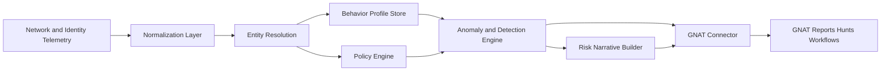

<p align="center">
  
</p>

# SenseGNAT — Behavior is the signal.

SenseGNAT is a behavioral analytics companion to GNAT, the threat intelligence platform. It builds per-entity behavioral baselines from normalized network telemetry, runs explainable detectors against those baselines, and emits STIX 2.1 findings into GNAT via TAXII 2.1. Every finding includes a human-readable summary and a structured evidence dict — no opaque scores, no black boxes.

---

## Key capabilities

- **5 source adapters** — Zeek conn.log, Suricata EVE JSON, named-column CSV, a live Kafka/GNAT telemetry feed, and a built-in sample fixture
- **4 explainable detectors** — rare destination, peer deviation, policy violation, and time-window drift
- **Policy-guided baselining** — YAML rules seed profiles before telemetry arrives, solving the cold-start problem
- **STIX 2.1 output via TAXII 2.1** — findings become `indicator` objects; narratives become `note` objects in GNAT
- **JSON-backed profile persistence** — baselines accumulate across runs via `BehaviorProfile.merge()`
- **231 passing tests** — unit and integration coverage across all adapters, detectors, and stores

---

## Quick start

```bash
# 1. Install in editable mode (required — package lives at the project root)
pip install -e .

# 2. Run the built-in example
python examples/run_phase_a.py

# 3. Run the test suite
pytest
```

The example runs against an in-memory store by default. On the first run it builds a baseline profile and emits no findings. On the second run it detects the novel destination and emits a STIX `indicator` and a STIX `note`. See [Tutorial 1](docs/tutorials/01-getting-started.md) for a step-by-step walkthrough.

---

## Documentation

| Section | What's in it |
|---------|-------------|
| [Tutorials](docs/tutorials/) | Step-by-step guides for learning SenseGNAT |
| [How-to Guides](docs/how-to/) | Task-focused recipes (add a detector, configure policies, etc.) |
| [Reference](docs/reference/) | Data model, API surface, configuration schema |
| [Explanation](docs/explanation/) | Architecture, design decisions, and the reasoning behind them |

---

## Architecture

SenseGNAT is structured in three layers. The **ingestion layer** normalizes telemetry from any source into `NormalizedNetworkEvent` objects via `EventAdapter` subclasses. The **analytics layer** builds per-subject `BehaviorProfile` objects using `ProfileBuilder`, then runs four explainable detectors against those profiles. The **output layer** serializes findings and narratives to STIX 2.1 and delivers them to GNAT via `GNATConnector`.



Full data flow and design rationale: [docs/explanation/architecture.md](docs/explanation/architecture.md)

---

## What's implemented

### Source adapters

| Adapter | Format |
|---------|--------|
| `SampleEventAdapter` | Synthetic fixture events for tests and examples |
| `CsvEventAdapter` | Named-column CSV with ISO 8601 or Unix-epoch timestamps |
| `ZeekConnLogAdapter` | Zeek `conn.log` TSV with dynamic `#fields` header |
| `SuricataEveAdapter` | Suricata EVE JSON `flow` and `alert` records |
| `GNATTelemetryAdapter` | Live sensor telemetry from GNAT's Kafka topic (`gnat.telemetry`) |

### Detectors

| Detector | Finding type | What it catches |
|----------|-------------|-----------------|
| `RareDestinationDetector` | `rare-destination` | Destination not in subject's profile |
| `PeerDeviationDetector` | `peer-deviation` | Destination or port absent from all peer profiles |
| `PolicyViolationDetector` | `policy-violation` | Destination or port outside the YAML allow-list |
| `TimeWindowDriftDetector` | `time-window-drift` | Burst of novel destinations relative to established profile |

### Key components

| Component | Location | Purpose |
|-----------|----------|---------|
| `ProfileBuilder` | `sensegnat/behavior/profiler.py` | Builds `BehaviorProfile` per subject from events + policy |
| `PolicyEngine` | `sensegnat/policy/engine.py` | Loads per-subject and per-group YAML rules |
| `NarrativeBuilder` | `sensegnat/narrative/` | Rolls per-subject findings into a `Narrative` |
| `GNATConnector` | `sensegnat/connectors/gnat_connector.py` | STIX 2.1 serialization + TAXII 2.1 transport |
| `JsonProfileStore` | `sensegnat/storage/json_store.py` | Disk-backed profile persistence with merge-on-write |
| `SenseGNATService` | `sensegnat/api/service.py` | Orchestrates the full pipeline in `run_once()` |

---

## Contributing

Developer conventions, package layout, data flow, and instructions for adding new adapters and detectors are in [CLAUDE.md](CLAUDE.md). Architecture decision records are in [docs/archtiecture/adrs/](docs/archtiecture/adrs/).
