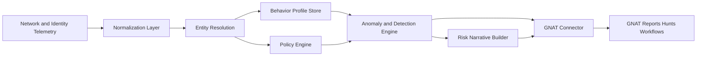

# SenseGNAT Architecture Diagram

```mermaid
flowchart LR
    A[Network and Identity Telemetry] --> B[Normalization Layer]
    B --> C[Entity Resolution]
    C --> D[Behavior Profile Store]
    C --> E[Policy Engine]
    D --> F[Anomaly and Detection Engine]
    E --> F
    F --> G[Risk Narrative Builder]
    F --> H[GNAT Connector]
    G --> H
    H --> I[GNAT Reports Hunts Workflows]
```
