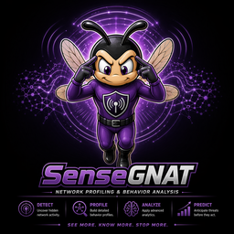

  

# SenseGNAT

Behavior analytics companion to GNAT. Builds per-entity baselines from
normalized network telemetry, runs explainable detectors against those
baselines, and emits STIX 2.1 findings back into GNAT via TAXII 2.1.

**Behavior is the signal.**

Source: [`github.com/wrhalpin/SenseGNAT`](https://github.com/wrhalpin/SenseGNAT).

---

## Documentation

Organised with the [Diátaxis](https://diataxis.fr/) framework. Four
quadrants for four kinds of reader-intent:

|                | **Action (doing)**                  | **Study (reading)**              |
|----------------|-------------------------------------|----------------------------------|
| **Learning**   | [Tutorials](tutorials/)             | [Explanation](explanation/)      |
| **Working**    | [How-to guides](how-to/)            | [Reference](reference/)          |

### Start here if you're…

- **New to SenseGNAT** → [tutorials/01 — Getting started](tutorials/01-getting-started.md)
- **Writing a custom adapter** → [tutorials/02 — Write a custom adapter](tutorials/02-write-a-custom-adapter.md)
- **Adding a new detector** → [how-to/add-a-detector](how-to/add-a-detector.md)
- **Pushing findings into GNAT** → [how-to/integrate-with-gnat](how-to/integrate-with-gnat.md)
- **Understanding the architecture** → [explanation/architecture](explanation/architecture.md)
- **Looking up a data type** → [reference/data-model](reference/data-model.md)

---

## What SenseGNAT does, end to end

1. **Ingest** — an `EventAdapter` reads telemetry from any source (Zeek
   conn.log, Suricata EVE JSON, CSV, or custom) and yields
   `NormalizedNetworkEvent` objects with a consistent five-tuple schema.

2. **Profile** — `ProfileBuilder` aggregates events into per-entity
   `BehaviorProfile` objects. Profiles are seeded from YAML policy rules
   before telemetry arrives, so day-one traffic to approved destinations
   is never flagged as anomalous.

3. **Detect** — four stateless, explainable detectors run against each
   event and its profile:
   - `RareDestinationDetector` — flags destinations absent from the
     entity's baseline.
   - `PeerDeviationDetector` — flags destinations unique to one entity
     within its peer group.
   - `PolicyViolationDetector` — flags traffic that violates an explicit
     allow-list rule.
   - `TimeWindowDriftDetector` — flags a burst of new destinations in
     the current batch relative to the established baseline size.

4. **Narrate** — `NarrativeBuilder` rolls per-entity findings into a
   `Narrative` with severity rollup, type frequency, and a human-readable
   summary.

5. **Publish** — `GNATConnector` converts findings to STIX 2.1 Indicator
   objects and narratives to STIX 2.1 Note objects, then POSTs them as
   STIX bundles to the GNAT TAXII 2.1 collection endpoint.

---

## Key design choices

- **Explainability first.** Every `Finding` carries a `summary`
  (human-readable sentence) and an `evidence` dict (the specific data
  that triggered it). Analysts know exactly what to look at.
  Rationale: [explanation/explainability-first](explanation/explainability-first.md).

- **Policy-guided baselining.** Policy seeds the baseline with known-good
  patterns before telemetry arrives, solving the cold-start problem.
  Telemetry then refines the baseline over time.
  Rationale: [explanation/policy-guided-baselining](explanation/policy-guided-baselining.md).

- **Profile accumulation across runs.** `BehaviorProfile.merge()` unions
  observation sets on every write, so baselines grow without losing history.

- **STIX 2.1 as the output contract.** Findings surface in GNAT as
  standard Indicator and Note objects with `x_gnat_*` telemetry properties
  and `x_sensegnat_*` behavioral metadata.
  See: [reference/gnat-connector](reference/gnat-connector.md).

- **Standalone by design.** SenseGNAT integrates with GNAT via connector
  contract — it does not modify GNAT core. Independent release cadence,
  independent storage, independent scheduling.

---

## What's implemented

| Area | Component |
|---|---|
| **Adapters** | `SampleEventAdapter`, `CsvEventAdapter`, `ZeekConnLogAdapter`, `SuricataEveAdapter` |
| **Detectors** | `RareDestinationDetector`, `PeerDeviationDetector`, `PolicyViolationDetector`, `TimeWindowDriftDetector` |
| **Storage** | `InMemoryProfileStore`, `InMemoryFindingStore`, `JsonProfileStore`, `JsonFindingStore` |
| **Policy** | `PolicyEngine` — YAML-driven group/subject allow-lists with peer-group assignment |
| **Narrative** | `NarrativeBuilder` — per-entity severity rollup and type-frequency summary |
| **Connector** | `GNATConnector` — STIX 2.1 Indicator + Note, TAXII 2.1 POST with Bearer auth |
| **Config** | `SenseGNATSettings` — Pydantic model, YAML loader |
| **Tests** | 189 passing tests |

---

## Status

Four source adapters, four explainable detectors, and a fully-wired GNAT
connector are shipped. Profile accumulation, policy-guided baselining, and
narrative building are complete. A live GNAT telemetry adapter (Phase C) is
the only remaining capability.

Licensed under [Apache 2.0](https://github.com/wrhalpin/SenseGNAT/blob/main/LICENSE).
